# Setup Windows Machine for ML/DL Using CUDA (Nvidia RTX GPU)

This is a complete guideline that I use to set up my computer for CUDA specific workload on my Windows machine via WSL2.

 :arrow_right_hook: If you are also interested about my current specification that I use for this task. 

Processor: Ryzen 5 3500X 6 Core and 6 Threads  
RAM: 32GB DDR4 3200MHz (16 GB + 8 GB + 8 GB)  
GPU: Zotac RTX 3050 8GB GDDR6  
Motherboard: Gigabyte B450M Aorous Elite  
Monitor: MSI Optix G24 Gaming Curved 75Hz  

Fun fact! I hate RGB!

For this guideline, I will be using the Windows 11 Pro (Version 22H2) and WSL2 (of course!).

## Step 1: Internet & Electricity

This whole processes can take a lot of time. Therefore, make sure to ensure proper connectivity of the internet and the electricity. For me, it took almost 7 hours in total. You would also need to download some pretty huge packages along the way.

## Step 2: Latest PowerShell

I will be using the latest PowerShell. You can download that from the Microsoft store, but I will download from the official website as the store might create some problems later.
Go to [the official website](https://learn.microsoft.com/en-us/powershell/scripting/install/installing-powershell-on-windows). This normally redirects you to the latest version of PowerShell available on that moment. For me, the latest version is 7.3 (24 May 2023). For you, it might be the updated version. Don't worry about that. Simply download the latest stable version.

1. Click on **Download PowerShell** button.   
2. Find the latest PowerShell of `win-x64.msi`. Download that.   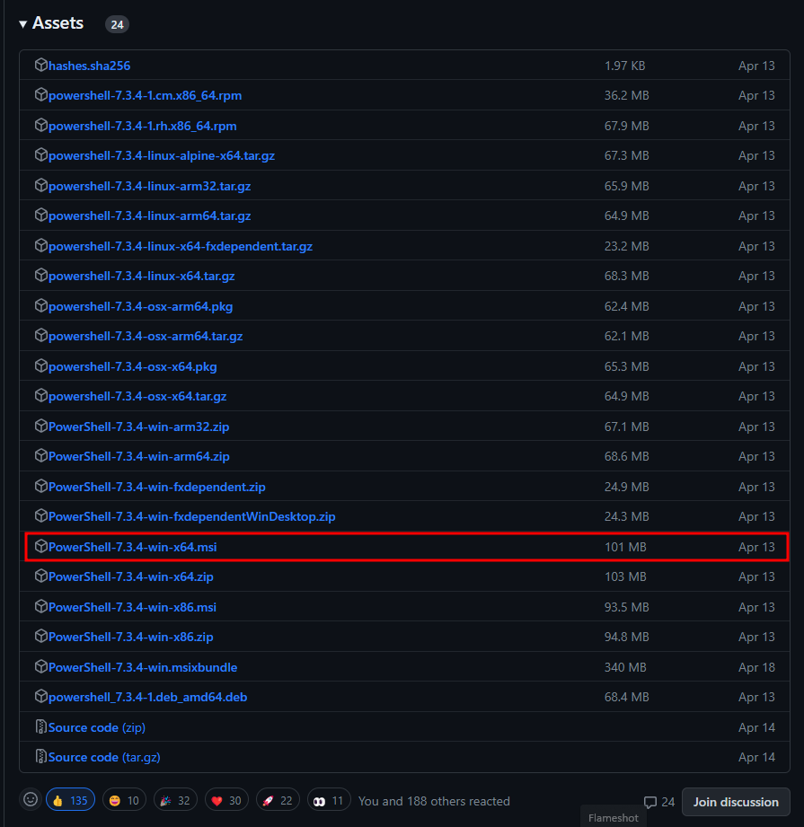
3. The installation process is pretty straightforward. However, I will be guiding you througout the entire processes. Double click on the downloaded file. Then click `Next`.   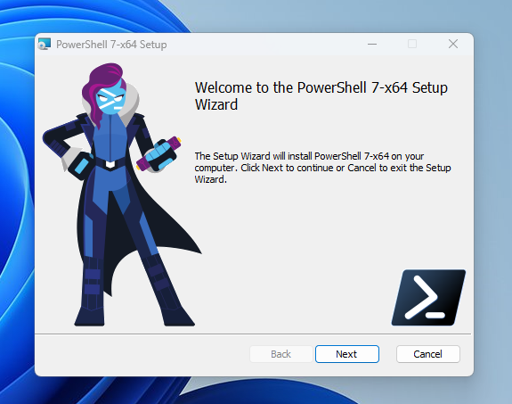
4. Keep everything as it is and click `Next`.   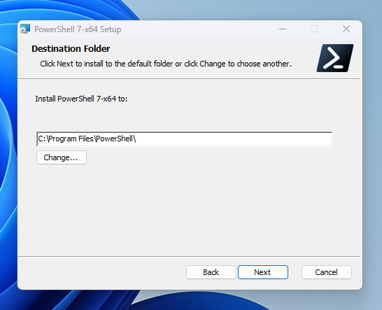
5. I still prefer to keep everything as it is and simply click `Next`.   
6. I still prefer to keep everything as it is and simply click `Next`.   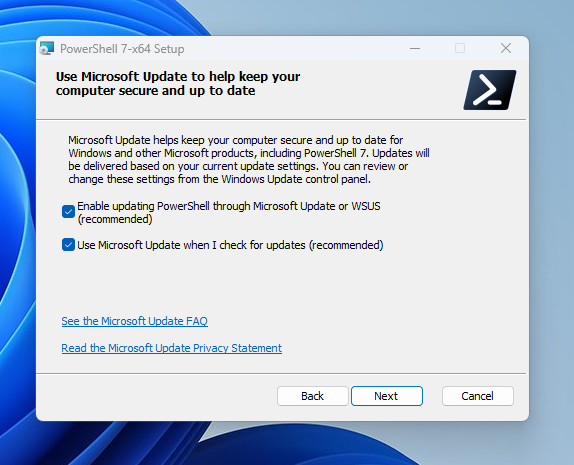
7. Click `Install`.   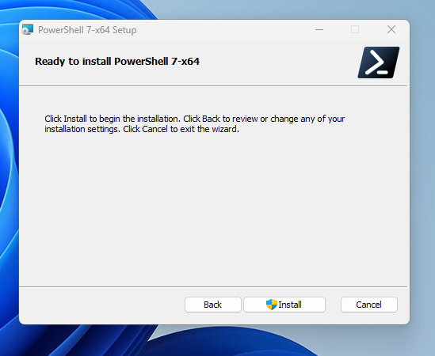
8. Now click `Finish`.   

## Step 3: Windows Terminal

I really like the Windows Terminal as I can simply switch to any other WSL OSes (Ubuntu, Kali, Git Bash, etc.) whenever I want. But before proceeding further, I have to make sure that my current Windows Terminal is the updated one.

1. Open the **Microsoft Store** and search for `Windows Terminal`.   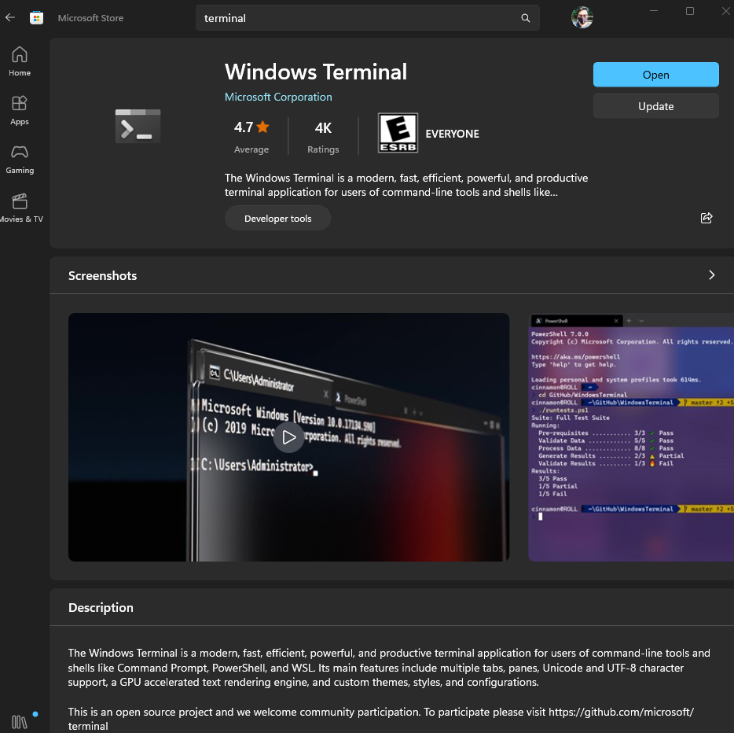
2. Click on `Update` if it needs the update. 
3. Make sure that you are on the latest updated Windows Terminal already.
4. Now open the Windows Terminal, and we have to change some settings first. Click on `Open Settings`.   
5. If you do not see the `Open Settings` prompt, then simply click the drop-down arrow, and click on `Settings`.   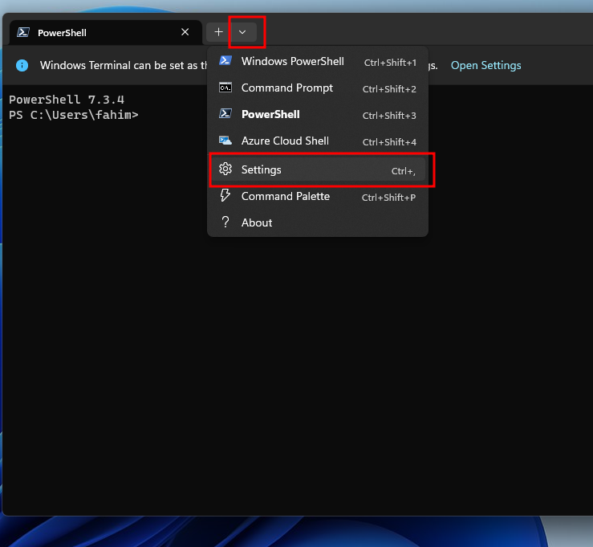
6. From `Startup`, make sure that the **Default profile** is set on `PowerShell` (The new PowerShell we installed in [Step 2](#step-2-latest-powershell)). The `Default terminal appplication` should be set on `Windows Terminal`.   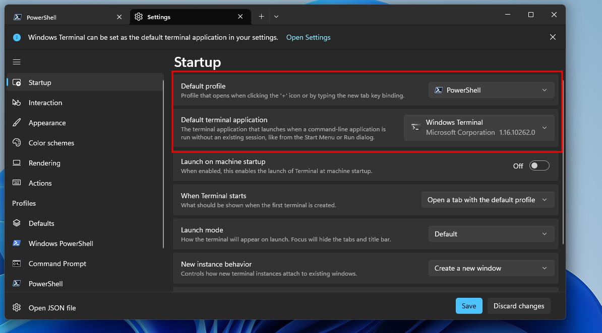
7. Then click `Save` and exit the terminal.   

## Step 4: Hardware Virtualization

For using the WSL, we have to make sure that our CPU virtualization is enabled. You can check the status through your task manager.   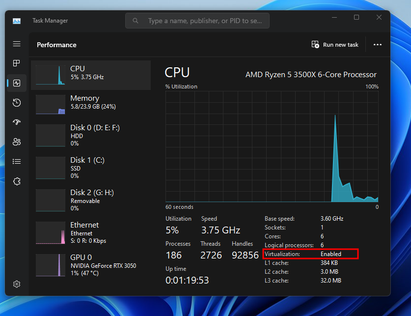

## Step 5: WSL & Ubuntu LTS

Now we need to install the WSL2 and Ubuntu LTS.

1. Open the Windows Terminal as an **Administrator**.   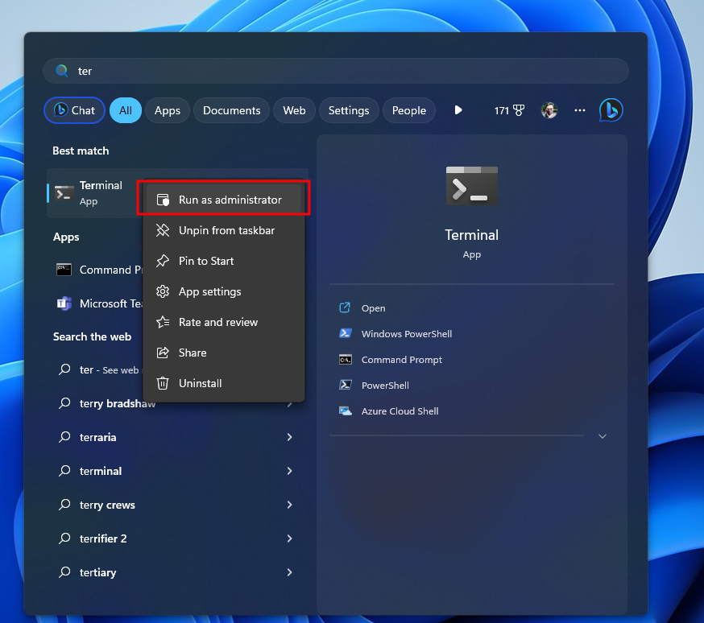
2. For installing the **WSL**, use the command `wsl --install`.      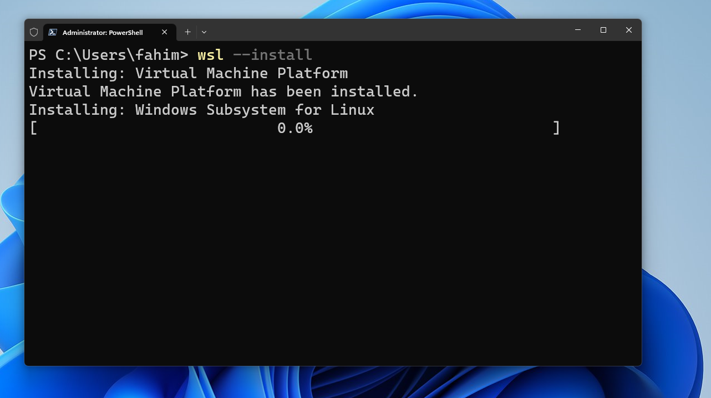
3. Then, it would automatically install the latest LTS version of Ubuntu.   
4. After the tasks get finished, it would prompt you for rebooting your PC. Save other works and simply restart your computer.   
5. After restarting the PC, it would automatically open the terminal and ask you for the username and password for your Linux OS.   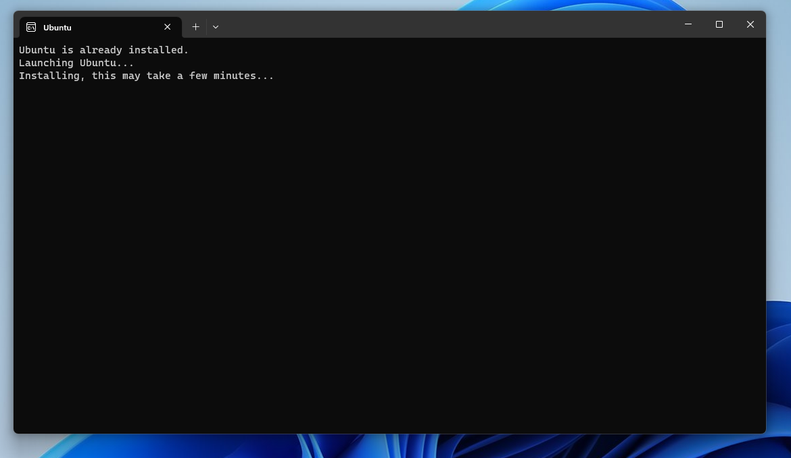
6. Give the Username and Password. Make sure to use the same Password on Retype Password!   
7. After a while, it will install the necessary components.   
8. Now, make sure that **WSL2** becomes the default WSL in this terminal. Apply the command, `wsl --set-default-version 2`.   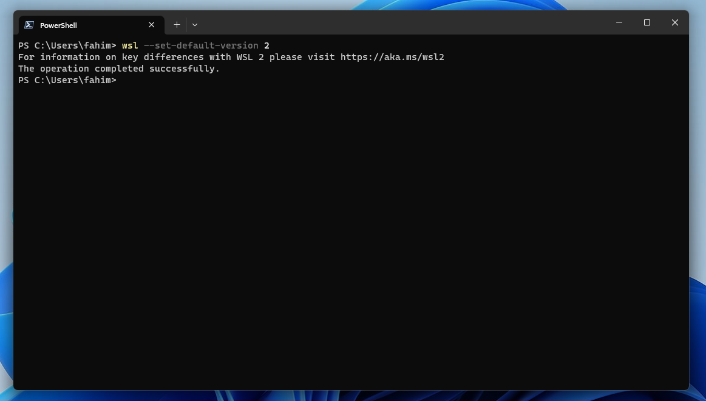
9. If you want to check the WSL OSes status (How many of OSes are available, how many of them are running or stopped), use the command, `wsl --list --verbose`.      Here, it is telling me that I have **Ubuntu** installed on my WSL version 2 and it is currently stopped.
10. However, after working on a WSL OS, if you want to shut down the OS, then you can use the command `wsl -t distro_name`. For me, it is Ubuntu, therefore, I used `wsl -t Ubuntu`. `t` represents the **termination** command here. 
11. If you have multiple OSes in WSL, and if you want to run any specific distribution, then use the command `wsl --distribution distribution_name`. For example, if I want to run Ubuntu specifically, the command would be `wsl --distribution Ubuntu`. If you only have one distribution, then you do not necessarily need to worry about this at all.   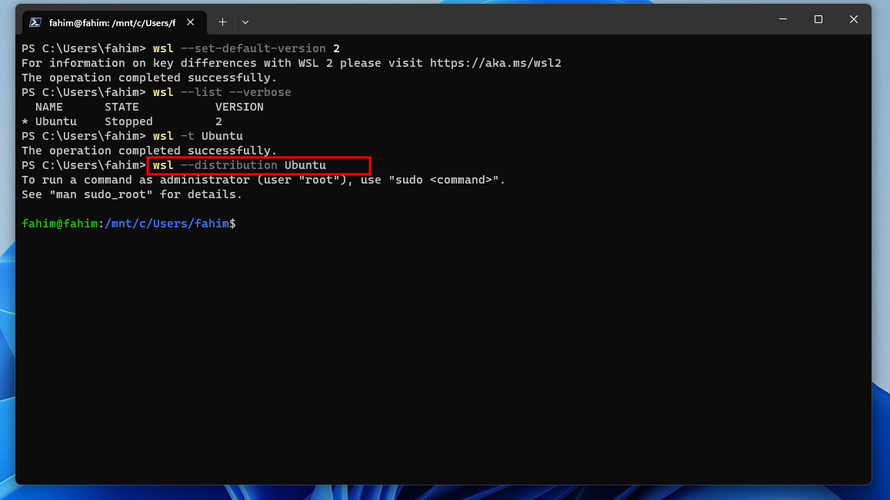
12. You can simply use `exit` to exit a distro from the terminal. It might not necessarily shut down the distribution. You have specifically use the termination command for that. However, some regularly used commands are here.   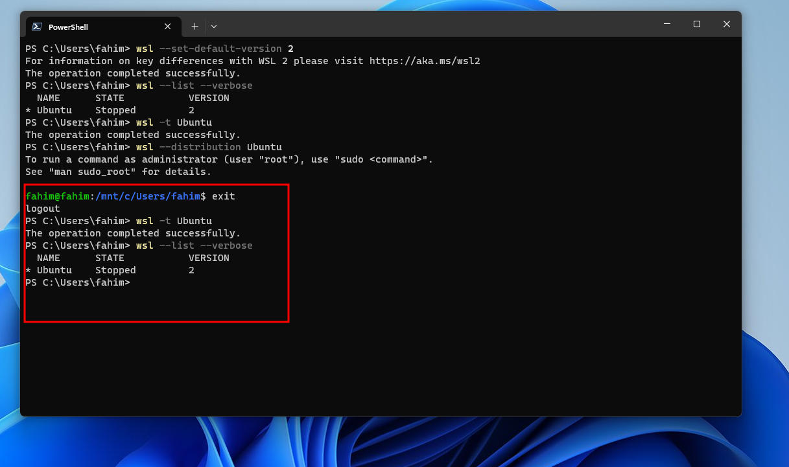
13. After installing a distribution, you would also be able to see and go there by using the drop-down menu from the Windows Terminal.   

## Step 6: Configure Ubuntu LTS

We need to update and install some apps now.

1. Open Ubuntu by using any method inside the Windows Terminal. You can obviously use the dedicated **Ubuntu App**. But I always prefer the Terminal as I can use multiple different distributions and command line applications here altogether.   
2. Update the system by using the command `sudo apt update`.   
3. If you get errors in updating/upgrading saying it can't reach to the server then change the nameserver with the command `echo "nameserver 8.8.8.8" | sudo tee /etc/resolv.conf > /dev/null
`.
4. After updating, upgrade the system using `sudo apt upgrade`.         You can clear the terminal by using the `clear` command.
5. CUDA works with C. Thus, we need to install the gcc compiler first. Use the command `sudo apt install gcc --fix-missing`.         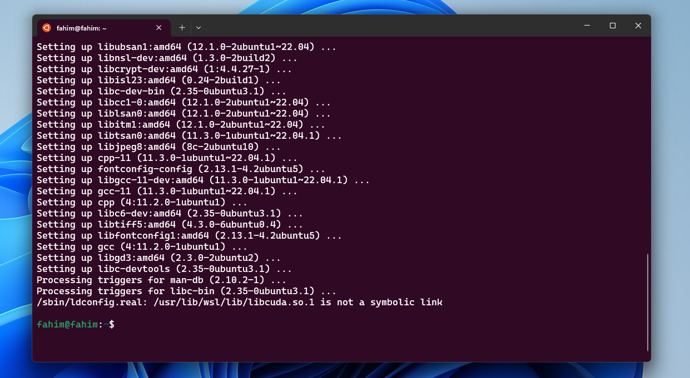