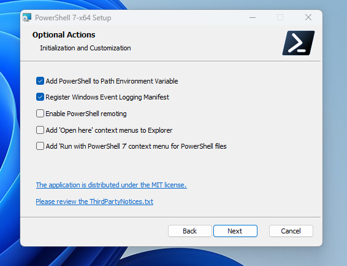

# Setup Windows Machine for ML/DL Using CUDA (Nvidia RTX GPU)

This is a complete guideline that I use to set up my computer for CUDA specific workload on my Windows machine via WSL2.

 :arrow_right_hook: If you are also interested about my current specification that I use for this task. 

Processor: Ryzen 5 3500X 6 Core and 6 Threads  
RAM: 32GB DDR4 3200MHz (16 GB + 8 GB + 8 GB)  
GPU: Zotac RTX 3050 8GB GDDR6  
Motherboard: Gigabyte B450M Aorous Elite  
Monitor: MSI Optix G24 Gaming Curved 75Hz  

Fun fact! I hate RGB!

For this guideline, I will be using the Windows 11 Pro (Version 22H2) and WSL2 (of course!).

## Step 1: Internet & Electricity

This whole processes can take a lot of time. Therefore, make sure to ensure proper connectivity of the internet and the electricity. For me, it took almost 7 hours in total. You would also need to download some pretty huge packages along the way.

## Step 2: Latest PowerShell

I will be using the latest PowerShell. You can download that from the Microsoft store, but I will download from the official website as the store might create some problems later.
Go to [the official website](https://learn.microsoft.com/en-us/powershell/scripting/install/installing-powershell-on-windows). This normally redirects you to the latest version of PowerShell available on that moment. For me, the latest version is 7.3 (24 May 2023). For you, it might be the updated version. Don't worry about that. Simply download the latest stable version.

1. Click on **Download PowerShell** button.   
2. Find the latest PowerShell of `win-x64.msi`. Download that.   
3. The installation process is pretty straightforward. However, I will be guiding you througout the entire processes. Double click on the downloaded file. Then click `Next`.   
4. Keep everything as it is and click `Next`.   
5. I still prefer to keep everything as it is and simply click `Next`.   
6. 
